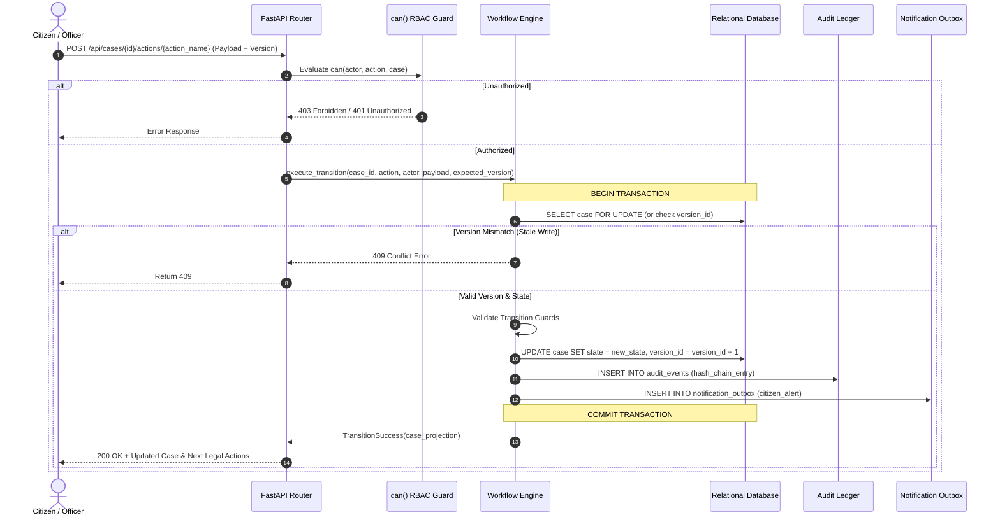
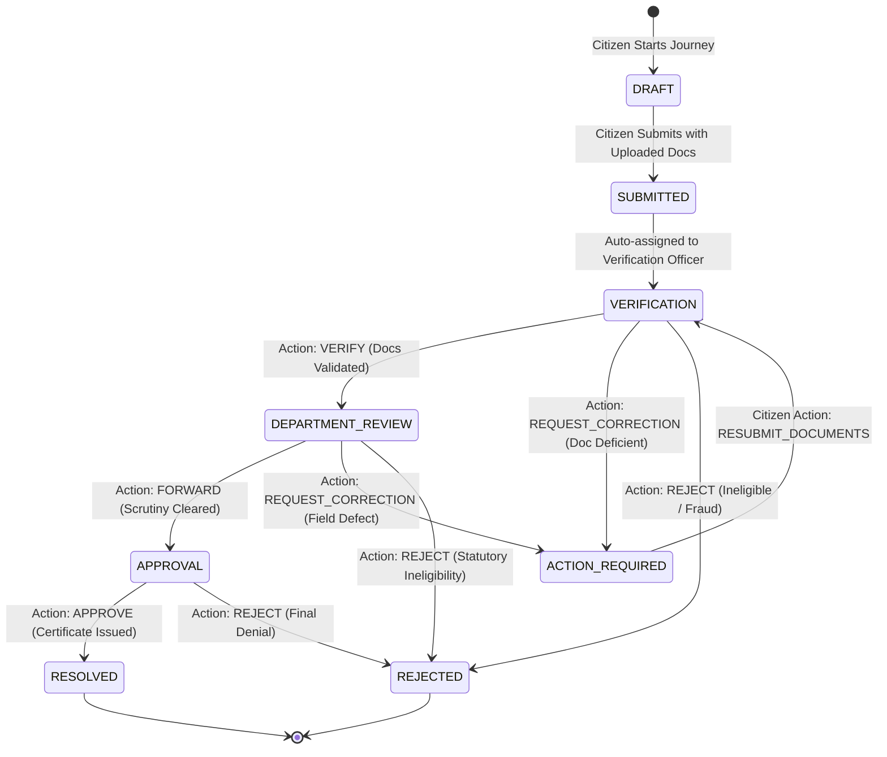
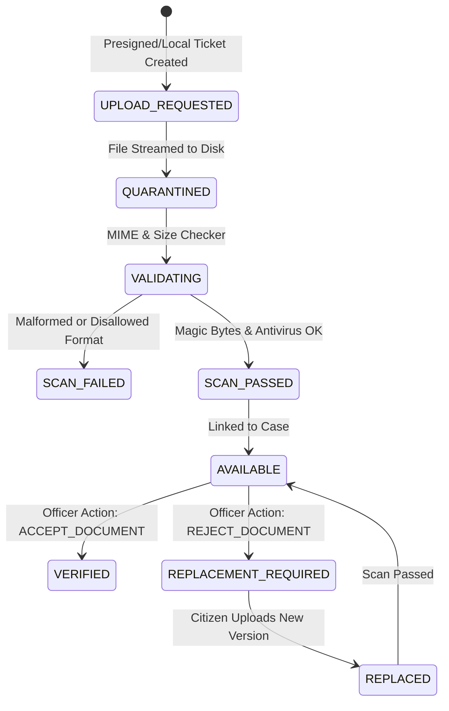
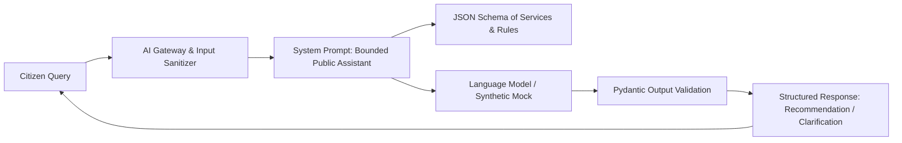

# 03 — JANSAHAY System Design & Lifecycles

## 1. Request Lifecycle & Transaction Boundary

All state-modifying requests execute within a strict transactional boundary:

---

## 2. Core Case State Machine Lifecycle (Certificate Journey)

---

## 3. Document Processing Lifecycle

---

## 4. Assistive AI Interaction Architecture

The AI has **no direct database write access** and is strictly isolated from changing state machines.
