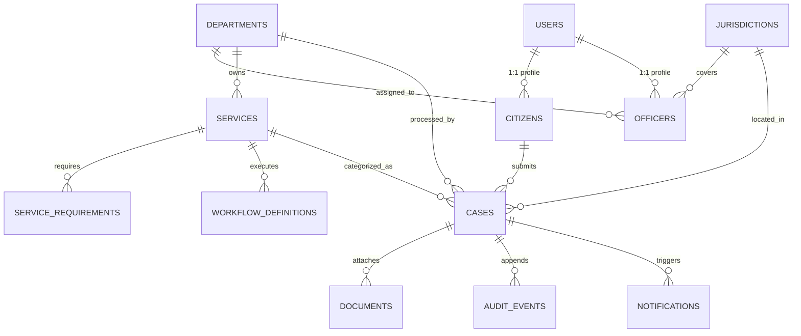

# 04 — JANSAHAY Database Schema Specification

## 1. Relational Entity Overview

The schema is normalized to support atomic transactions, optimistic locking (`version_id`), multi-tenant isolation, role-based scoping, and tamper-evident audit hashing.

---

## 2. Table Definitions

### 2.1 Identity & Scoping Tables

#### `users`
- `id` (VARCHAR(36), PK): UUID
- `username` (VARCHAR(64), UNIQUE, NOT NULL): Synthetic login identifier (e.g. `citizen_rahul`, `vo_delhi_01`)
- `email` (VARCHAR(128), UNIQUE, NOT NULL)
- `phone_number` (VARCHAR(20), NOT NULL): Synthetic mobile number (+91-9876543210)
- `password_hash` (VARCHAR(255), NOT NULL): Argon2/Bcrypt hash
- `role` (VARCHAR(32), NOT NULL): `CITIZEN`, `VERIFICATION_OFFICER`, `DEPARTMENT_OFFICER`, `APPROVING_OFFICER`, `SYSTEM_ADMIN`
- `is_active` (BOOLEAN, DEFAULT TRUE)
- `created_at` (TIMESTAMP, NOT NULL)
- `updated_at` (TIMESTAMP, NOT NULL)

#### `citizens`
- `id` (VARCHAR(36), PK): UUID
- `user_id` (VARCHAR(36), FK $\to$ users.id, UNIQUE, NOT NULL)
- `full_name` (VARCHAR(128), NOT NULL)
- `synthetic_aadhaar_last4` (VARCHAR(4), NOT NULL): e.g. "4321" (Mock only)
- `date_of_birth` (DATE, NOT NULL)
- `address_line` (TEXT, NOT NULL)
- `district` (VARCHAR(64), NOT NULL)
- `state` (VARCHAR(64), NOT NULL)
- `pincode` (VARCHAR(6), NOT NULL)

#### `departments`
- `id` (VARCHAR(36), PK): UUID
- `code` (VARCHAR(32), UNIQUE, NOT NULL): `REVENUE`, `EPFO`, `PUBLIC_GRIEVANCE`, `SOCIAL_WELFARE`
- `name` (VARCHAR(128), NOT NULL)
- `description` (TEXT)

#### `jurisdictions`
- `id` (VARCHAR(36), PK): UUID
- `code` (VARCHAR(32), UNIQUE, NOT NULL): `DELHI_CENTRAL`, `DELHI_SOUTH`, `MUMBAI_SUBURBAN`, `BANGALORE_URBAN`
- `name` (VARCHAR(128), NOT NULL)
- `state` (VARCHAR(64), NOT NULL)

#### `officers`
- `id` (VARCHAR(36), PK): UUID
- `user_id` (VARCHAR(36), FK $\to$ users.id, UNIQUE, NOT NULL)
- `employee_code` (VARCHAR(32), UNIQUE, NOT NULL)
- `full_name` (VARCHAR(128), NOT NULL)
- `designation` (VARCHAR(128), NOT NULL)
- `department_id` (VARCHAR(36), FK $\to$ departments.id, NOT NULL)
- `jurisdiction_id` (VARCHAR(36), FK $\to$ jurisdictions.id, NOT NULL)

---

### 2.2 Services & Workflows

#### `services`
- `id` (VARCHAR(36), PK): UUID
- `code` (VARCHAR(64), UNIQUE, NOT NULL): `INCOME_CERTIFICATE`, `EPFO_CLAIM_TRANSFER`, `STREET_LIGHT_GRIEVANCE`
- `title` (VARCHAR(128), NOT NULL)
- `category` (VARCHAR(64), NOT NULL): `CERTIFICATES`, `SOCIAL_SECURITY`, `GRIEVANCES`
- `department_id` (VARCHAR(36), FK $\to$ departments.id, NOT NULL)
- `sla_days` (INTEGER, NOT NULL, DEFAULT 7)
- `eligibility_criteria_json` (JSON, NOT NULL)
- `is_active` (BOOLEAN, DEFAULT TRUE)

#### `service_requirements`
- `id` (VARCHAR(36), PK): UUID
- `service_id` (VARCHAR(36), FK $\to$ services.id, NOT NULL)
- `document_type_code` (VARCHAR(64), NOT NULL): `IDENTITY_PROOF`, `INCOME_PROOF`, `RESIDENCE_PROOF`, `SALARY_SLIP`
- `document_name` (VARCHAR(128), NOT NULL)
- `is_mandatory` (BOOLEAN, DEFAULT TRUE)
- `allowed_extensions` (VARCHAR(64), NOT NULL): `.pdf,.jpg,.jpeg,.png`
- `max_size_kb` (INTEGER, NOT NULL, DEFAULT 5120)

#### `workflow_definitions`
- `id` (VARCHAR(36), PK): UUID
- `service_id` (VARCHAR(36), FK $\to$ services.id, NOT NULL)
- `version` (INTEGER, NOT NULL, DEFAULT 1)
- `initial_state` (VARCHAR(64), NOT NULL, DEFAULT 'SUBMITTED')
- `definition_json` (JSON, NOT NULL): Declarative state machine containing states, actions, guards, and transition maps.
- `is_active` (BOOLEAN, DEFAULT TRUE)

---

### 2.3 Cases & Core State Machine

#### `cases`
- `id` (VARCHAR(36), PK): UUID
- `public_case_id` (VARCHAR(32), UNIQUE, NOT NULL): e.g. `JS-2026-INC-89214`
- `service_id` (VARCHAR(36), FK $\to$ services.id, NOT NULL)
- `workflow_version` (INTEGER, NOT NULL, DEFAULT 1)
- `citizen_id` (VARCHAR(36), FK $\to$ citizens.id, NOT NULL)
- `department_id` (VARCHAR(36), FK $\to$ departments.id, NOT NULL)
- `jurisdiction_id` (VARCHAR(36), FK $\to$ jurisdictions.id, NOT NULL)
- `current_state` (VARCHAR(64), NOT NULL): e.g. `SUBMITTED`, `VERIFICATION`, `DEPARTMENT_REVIEW`, `ACTION_REQUIRED`, `APPROVAL`, `RESOLVED`, `REJECTED`
- `version_id` (INTEGER, NOT NULL, DEFAULT 1): Optimistic locking incrementor
- `assigned_officer_id` (VARCHAR(36), FK $\to$ officers.id, NULLABLE)
- `form_data_json` (JSON, NOT NULL): Form responses, declarations, questionnaire answers
- `resolution_remarks` (TEXT, NULLABLE)
- `submitted_at` (TIMESTAMP, NOT NULL)
- `updated_at` (TIMESTAMP, NOT NULL)

#### `documents`
- `id` (VARCHAR(36), PK): UUID
- `case_id` (VARCHAR(36), FK $\to$ cases.id, NOT NULL)
- `requirement_id` (VARCHAR(36), FK $\to$ service_requirements.id, NOT NULL)
- `file_name` (VARCHAR(255), NOT NULL)
- `file_path` (VARCHAR(512), NOT NULL): Private storage locator
- `mime_type` (VARCHAR(64), NOT NULL)
- `file_size_bytes` (INTEGER, NOT NULL)
- `status` (VARCHAR(32), NOT NULL): `QUARANTINED`, `SCAN_PASSED`, `AVAILABLE`, `VERIFIED`, `REPLACEMENT_REQUIRED`, `REPLACED`
- `version` (INTEGER, NOT NULL, DEFAULT 1)
- `verification_notes` (TEXT, NULLABLE)
- `uploaded_at` (TIMESTAMP, NOT NULL)

#### `audit_events` (Cryptographic Event Ledger)
- `id` (VARCHAR(36), PK): UUID
- `case_id` (VARCHAR(36), FK $\to$ cases.id, NOT NULL)
- `event_sequence` (INTEGER, NOT NULL): Monotonically increasing index per case
- `actor_id` (VARCHAR(36), NOT NULL): User ID
- `actor_role` (VARCHAR(32), NOT NULL)
- `action` (VARCHAR(64), NOT NULL): `SUBMIT`, `VERIFY`, `REQUEST_CORRECTION`, `FORWARD`, `APPROVE`, `REJECT`, `RESUBMIT_DOCUMENTS`
- `from_state` (VARCHAR(64), NOT NULL)
- `to_state` (VARCHAR(64), NOT NULL)
- `remarks` (TEXT, NULLABLE)
- `previous_event_hash` (VARCHAR(64), NOT NULL): SHA-256 hash of prior event (or GENESIS for event 1)
- `event_hash` (VARCHAR(64), NOT NULL): SHA-256 hash of this event
- `created_at` (TIMESTAMP, NOT NULL)

#### `notification_outbox`
- `id` (VARCHAR(36), PK): UUID
- `case_id` (VARCHAR(36), FK $\to$ cases.id, NOT NULL)
- `recipient_user_id` (VARCHAR(36), FK $\to$ users.id, NOT NULL)
- `channel` (VARCHAR(32), NOT NULL): `IN_APP`, `SMS_MOCK`, `EMAIL_MOCK`
- `title` (VARCHAR(128), NOT NULL)
- `message` (TEXT, NOT NULL)
- `status` (VARCHAR(32), NOT NULL, DEFAULT 'PENDING'): `PENDING`, `PROCESSED`, `FAILED`
- `created_at` (TIMESTAMP, NOT NULL)
- `processed_at` (TIMESTAMP, NULLABLE)
