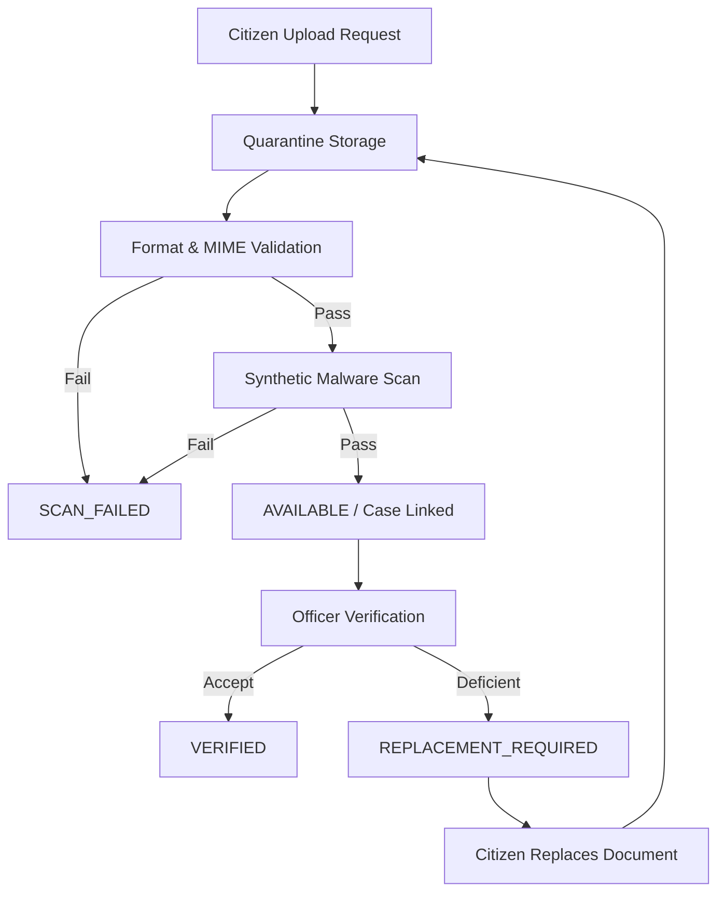

# 10 — JANSAHAY Document Management & Quarantine Pipeline

## 1. Multi-Stage Document Pipeline

---

## 2. Storage Strategy
- Files are saved in a sandboxed, non-public directory (`./storage/documents/<case_id>/<doc_id>.<ext>`).
- MIME validation uses magic bytes rather than trusting client HTTP headers.
- Authorized downloads are served through streaming responses validating `can(actor, VIEW_DOCUMENT, document)`.
- No direct static file serving URL is ever enabled.
