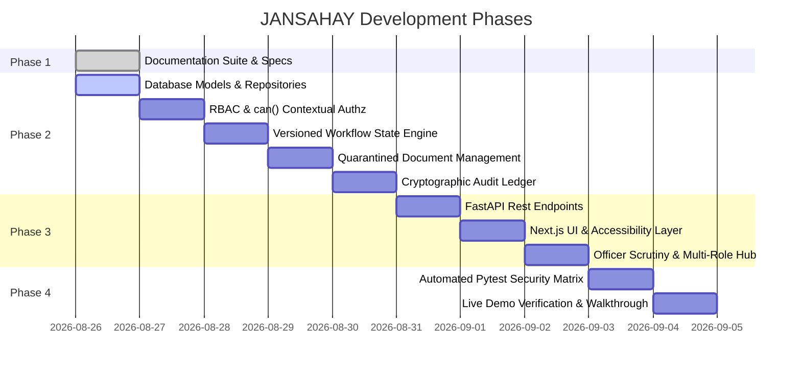

# 19 — JANSAHAY Phased Implementation & Development Plan

## 1. Phased Roadmap

```mermaid
gantt
    title JANSAHAY Development Phases
    dateFormat  YYYY-MM-DD
    section Phase 1
    Documentation Suite & Specs         :done, p1, 2026-08-26, 1d
    section Phase 2
    Database Models & Repositories      :active, p2, 2026-08-26, 1d
    RBAC & can() Contextual Authz       :p3, after p2, 1d
    Versioned Workflow State Engine     :p4, after p3, 1d
    Quarantined Document Management     :p5, after p4, 1d
    Cryptographic Audit Ledger          :p6, after p5, 1d
    section Phase 3
    FastAPI Rest Endpoints              :p7, after p6, 1d
    Next.js UI & Accessibility Layer    :p8, after p7, 1d
    Officer Scrutiny & Multi-Role Hub   :p9, after p8, 1d
    section Phase 4
    Automated Pytest Security Matrix    :p10, after p9, 1d
    Live Demo Verification & Walkthrough:p11, after p10, 1d
```
